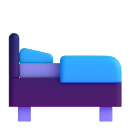
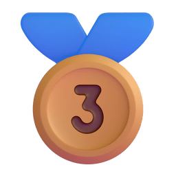
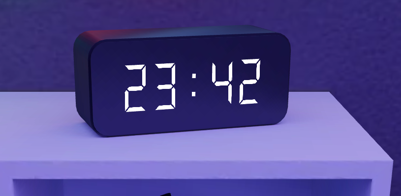
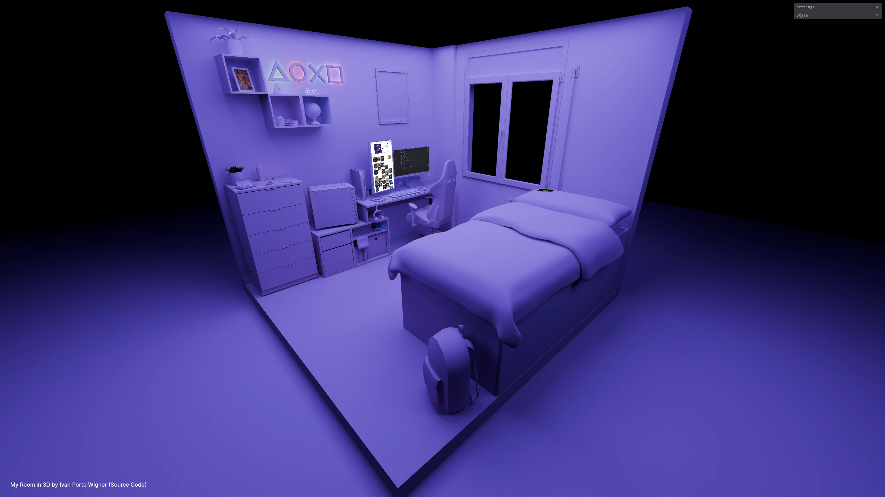

<h1 style="margin-top: 0;">
  
  &nbsp;
  My Room In 3D
</h1>

<h3>
Scored 3rd in Bruno Simon's monthly challenge!
</h3>

This was my entry to the 9th edition of the challenges organised by <a href="https://bruno-simon.com/">Bruno Simon</a> for the students of his <a href="https://threejs-journey.com/">Three.js Journey</a> course. The theme was <em><b>Isometric Room</em></b>, and even though I had just purchased the course when the challenge was announced, I decided to participate. Turned out pretty well! 🥉

🌐 [See it Live](https://my-room.pages.dev) | 🏆 [Winners](https://threejs-journey.com/challenges/009-isometric-room)

  <em>
    <b>A (quite a bit more) fancy replica of my room, in 3D.</b>
  </em>

[![Three.js Journey](https://img.shields.io/badge/Three.js%20Journey-705df2?style=for-the-badge&logo=data:image/svg%2bxml;base64,PHN2ZyB4bWxucz0iaHR0cDovL3d3dy53My5vcmcvMjAwMC9zdmciIGZpbGw9Im5vbmUiIHZpZXdCb3g9IjAgMCAzOCA0MyI+CiAgPHBhdGggZmlsbD0iI2ZmZmZmZiIgZD0iTTMuNSAzMS4wODU5Mzh2Ny45MTk5MjFjMCAuMzgxNy40MDg4MDM0LjYxMjQ3Ny43MzI0MjE5LjQyNTc4Mmw2Ljg1MTU2MjEtMy45NjA5Mzh6bTI0LjE2NDA2Mi0xMy45NzA3MDR2OC43Njk1MzJsNi44NDU3MDQtMy45NTcwMzJjLjMyNjk5NS0uMTg4OTk1LjMyNjk5NS0uNjY0NjE1IDAtLjg1MzUxNXptLTMgMC05LjA4MjAzMSA1LjI1MTk1NGMtLjAwNjQgMy4zMjE5OS4wMDU5IDYuNjQ0NzkyIDAgOS45NjY3OTZ2LjUzNTE1N2wzLjc4OTA2My0yLjE4OTQ1MyA0Ljk4MjQyMi0yLjg4MDg2Yy4xOTEwODUtLjExMTYxOC4zMTA1NDYtLjMxNTk5OS4zMTA1NDYtLjUzOTA2MnptLTIxLjE2NDA2MiAwdjEwLjUwMzkwN2w5LjA4MjAzMSA1LjI1MTk1M1YyMi4zNjcxODhabTEwLjU4MjAzMS03Ljc1NTg1OWMtLjEwNzA1IDAtLjIxNDg0Ny4wMjY4MDctLjMxMDU0Ny4wODIwMzFsLTguNzc1MzkwMiA1LjA3NDIxOWMzLjAyNzc4NzYgMS43NTA3MzggNi4wNTY5ODEyIDMuNTAwNTUzIDkuMDgyMDMxMiA1LjI1NTg1OWw5LjA4NTkzNy01LjI1NTg1OS0zLjc5Mjk2OC0yLjE5NTMxMy00Ljk4MDQ2OS0yLjg3ODkwNThoLS4wMDJjLS4wOTUyNDQtLjA1NDYwOS0uMjAwMTQyLS4wODIwMzEyLS4zMDY1OTQtLjA4MjAzMTJaTTMuOTgyNDIxOSAzLjUwMTk1MzFDMy43MzExNDQzIDMuNTA1OTQ3OCAzLjUgMy43MDg4NjczIDMuNSAzLjk5NjA5Mzh2Ny45MTk5MjIybDcuNTgzOTg0LTQuMzg2NzE5MS02Ljg1MTU2MjEtMy45NjA5Mzc1Yy0uMDgwNTg3LS4wNDY2MjItLjE2NjI0MS0uMDY3NzM4LS4yNS0uMDY2NDA2eiIvPgo8L3N2Zz4K)](https://threejs-journey.com/)

Inspired by the [original room](https://my-room-in-3d.vercel.app/) made by Bruno Simon years ago.

## 🎮 Controls

Upon entering the scene, you will be presented with a loading screen, there are many resources to load before the experience can start. Once everything is loaded, just tap anywhere and it will fade the loading screen away. After that, you can move around using the following controls:

- **Orbit Camera (Moving)**: Using the left mouse button (desktop) or 1 finger touch (mobile) and dragging.
- **Truck Camera (Panning)**: Using the right mouse button (desktop) or 2/3 fingers touch (mobile) and dragging.
- **Dolly Camera (Zooming)**: Using the mouse wheel, either scrolling or pressing it and dragging the mouse (desktop). 2 fingers pinch-in or out (mobile).

Made with the great [Camera Controls](https://github.com/yomotsu/camera-controls) library for Three.js.

## ✨ Features

The UI panel on the top right is made with [Tweakpane](https://tweakpane.github.io/docs/). You can use it to interact with some objects in the scene! At the time of writing the following objects/options can be played with:

- **Realtime Clock**: The clock over the shelves, should display the system time of the visitor's machine. You can also travel in time if you want, by changing it manually!

  

- **Neutral Mode**: This stills needs a few adjustments, but you can visualize the scene in a beautiful neutral palette. I'll probably end up making this mode less "noisy" by removing the videos and pictures if enabled.

> [!TIP]
> This can be done just by replacing the color information with a pre-baked map of the **lighting** information.

  

## 🚀 Future Work

These are some of the things I would like to add/improve, this list may change in the future, but as for know I have the following ideas:

- [ ] Some music 🎶, I was thinking of some [Lo-Fi](https://www.lofi.cafe/). Also add some way to visualize the playing audio 🤔.
- [ ] Bake an environment map for reflections. Right now, surfaces that are intended to reflect the surroundings are baked, and look a bit weird 😬.
- [ ] Object picking, with information tooltips about the selected objects 👀.
- [ ] Add a character (might not be a person). Not sure about this one, but I would like it 🤓.  
- [ ] Make any of the devices in the scene interactable. I'll need to learn more about Three before doing this, but could be an interesting feature 🧐.

## 🏅 Credits

Some of the objects in the scene weren't fully modeled by me, I want to use this section to thank the original artists of the items below for their amazing work.

- **Gaming Chair**: The original model was created by [Jayrenn Reeve](https://www.blenderkit.com/asset-gallery-detail/6618bae2-6829-4baa-8229-cf4529769bfa/). I modified it to simplify the geometry and reduce the polygon count, while also making it more alike the one I have.
<<<<<<< Updated upstream
- **Nintendo Switch**: The dock was grabbed from [here](https://grabcad.com/library/nintendo-switch-dock-1), and the actual console from [Sketchfab](https://sketchfab.com/3d-models/nintendo-switch-b30e0a74899b4f9baf030d02f45ab599), by Smoggybeard. Just like the chair, I modified it a bit to reduce the polygon count.
- **Dualsense**: The PS5 controller is now a paid model, but when I contacted the artist to let he know that I was having problems with the payment (didn't went through after several tries), he gave it to me for free, huge thanks to him. By [AIR-3D](https://www.cgtrader.com/3d-models/electronics/other/playstation-5-dualsense-controller-2e5aeea9-ef27-4f6c-a2d5-30778062359e).
- **Razer Headset**: The headphones on the stand of the desktop were made by [leonsavelind](https://sketchfab.com/3d-models/razer-kraken-v2-88dc32e383b243c1913bde9dd42f9200).
=======
- **Nintendo Switch**: The dock was grabbed from [here](https://grabcad.com/library/nintendo-switch-dock-1), and the actual console from [Smoggybeard](https://sketchfab.com/3d-models/nintendo-switch-b30e0a74899b4f9baf030d02f45ab599), on Sketchfab. Just like the chair, I modified it a bit to reduce the polygon count.
- **Dualsense**: The PS5 controller is now a paid model, but when I contacted the artist to let him know that I was having problems with the payment (didn't went through after several tries), he gave it to me for free, huge thanks to him. By [AIR-3D](https://www.cgtrader.com/3d-models/electronics/other/playstation-5-dualsense-controller-2e5aeea9-ef27-4f6c-a2d5-30778062359e).
- **Razer Headset**: The headphones on the stand of the desktop were made by [leonsavelind](https://sketchfab.com/3d-models/razer-kraken-v2-88dc32e383b243c1913bde9dd42f9200).

